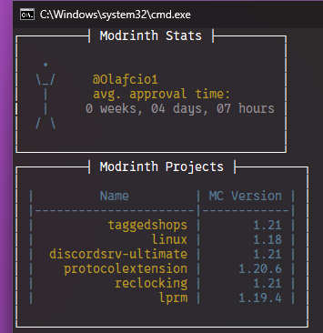

# 🗽 ModrinthStats
Modrinth Statistic Collector! 
Example screenshot: 

## ▶️ How to run
1. Click on the `Code` button with the code icon
   and click `Download ZIP`
2. Extract the ZIP it downloaded onto a folder on your PC
3. [Install Python](https://www.python.org/ftp/python/3.14.2/python-3.14.2-amd64.exe) if you don't have it installed
   **(with the `Add python.exe to PATH` option enabled,**
   **(and the `Use admin privileges` option DISABLED)**
4. Click Win+R, type `cmd` and press enter
5. Type `cd %USERPROFILE%\Downloads\ModrinthStats-main\ && python main.py`
6. Do what it says
